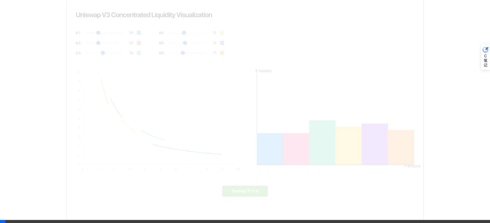
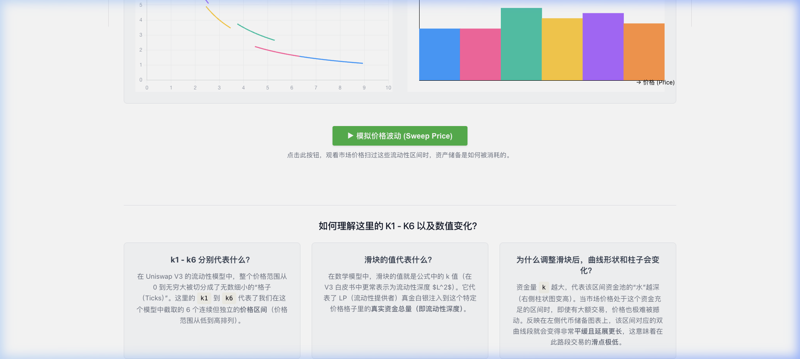

# Uniswap V3 Concentrated Liquidity Visualization 🦄

> An interactive web application designed to help users visually and intuitively understand the core mathematical and economic concepts behind Uniswap V3's Concentrated Liquidity.


---

## 📖 关于本项目 (About)

Uniswap V3 引入了 **集中流动性 (Concentrated Liquidity)** 的概念，允许流动性提供者 (LP) 将资金集中在特定的价格区间内，从而大幅提高资本效率。然而，对于初学者而言，理解“虚拟流动性 (Virtual Reserves)”、“流动性深度 $L^2$”以及它们如何改变价格曲线形状非常困难。

本项目通过极简干净的 UI 界面与交互式图表，将 Uniswap V3 晦涩的数学公式 ($x \cdot y = L^2$) 转化为肉眼可见的图形变化：
- **左侧图表**：分段、不连续的**资产储备双曲线**（直观展示虚拟储备和价格滑点）。
- **右侧图表**：显示各个独立价格区间内的**真实资金深度柱形图**。

## 📸 界面演示 (Demo)

### 1. 动态扫价交互 (Sweep Price & Trailing)
动画直观地演示了市价单是如何吞噬流动性的，以及价格滑点与区间深度的反比关系。


### 2. 极简的交互控制台与 FAQ
将繁杂的数学底层原理收纳进底部网格，保持主应用界面的极致干净。


## ✨ 核心特性 (Features)

1. **实时互动滑块 (Interactive Liquidity Bins)**
   预设了 6 个无缝衔接的价格区间（$k1$ 到 $k6$）。拖动滑块即可增加或减少该对应区间的资金量（$k = L^2$）。修改资金量的同时，你将“零延迟”地看到代币储备资产曲线的曲率是如何产生相应变化的（资金越厚的地方，曲线越平缓，即滑点极低）。
   
2. **Uniswap V2 / V3 完美对比演示 (V2 vs V3 Toggle)**
   点击「模拟 V2 连续流动性」按钮，系统会瞬间将所有区间的流动性深度调整为一致，让碎片化的曲线自动连贯拼接成一条完美的经典双曲线。借此可以立刻领悟到：**Uniswap V2 本质上只是流动性深度在全局价格范围内（0 到 $\infty$）处处相等的一种特殊的 V3**。

3. **动态扫价动画 (Sweep Price Animation)**
   提供了一键模拟市场大额市价单吞噬流动性的动画（Sweep Price）。动画包含轨迹追踪射线与 x 轴同步追踪红点，你可以极其直观地看到：
   - 当价格穿越高流动性区间时，价格变动极慢（低滑点）。
   - 当价格穿越枯竭区间时，价格变动剧烈（高滑点）。
   
4. **详尽的科普说明库 (In-Built FAQ)**
   在页面底部自带由浅入深的原理解析网格，直接为用户答疑解惑。

## 🛠️ 技术栈 (Tech Stack)

本项目恪守极简与高性能（KISS），没有过度工程化：
- **框架**：[React 18](https://reactjs.org/) (TypeScript)
- **构建工具**：[Vite](https://vitejs.dev/) (闪电般的冷启动和热更新)
- **可视化**：[Chart.js](https://www.chartjs.org/) + `react-chartjs-2` (禁用不必要动画，追求物理连动的零延迟反馈)
- **样式**：Vanilla CSS (拒绝过度臃肿的原子化类名，采用最纯净可控的自定义组件样式)

## 📦 独立运行版 (Standalone Version)

如果您不想安装 Node.js 或者进行复杂的构建，本项目提供了一个**单文件独立运行版**。它将所有的逻辑、样式和图表引擎整合在了一个 HTML 文件中，您可以直接双击打开体验：

- [uniswap-v3-standalone.html](./uniswap-v3-standalone.html)

> 该版本非常适合用于快速演示、离线查看或直接作为网页插件嵌入。

## 🚀 快速启动 (Getting Started)

1. **克隆项目到本地**
   ```bash
   git clone https://github.com/HuangLeFei/uniswap-v3-visualizer.git
   cd uniswap-v3-visualizer
   ```

2. **安装依赖**
   ```bash
   npm install
   ```

3. **启动开发服务器**
   ```bash
   npm run dev
   ```
   然后打开浏览器访问终端输出的本地地址 (通常为 `http://localhost:5173/`)。

4. **构建生产版本**
   ```bash
   npm run build
   ```

## 📐 核心算法文件指南

如果你想深入了解 V3 曲线是如何在一张二维图表上被正确渲染成碎片化双曲线的，请查看以下核心逻辑：
- `src/logic/uniswap-math.ts`: 负责基于价格边界 $P_a, P_b$ 以及流动性深度 $L^2$ 进行虚拟资产量 $x, y$ 的倒推和数据点生成的纯数学函数。

## 🤝 贡献说明

欢迎以提交 Issue 或者 Pull Request 的方式提供建议或优化。如果您发现该可视化工具在使用中未能正确表达 Uniswap V3 官方白皮书中的数学定义，非常欢迎指正！

## 📄 开源协议 (License)

本项目基于 [MIT License](./LICENSE) 协议开源。
